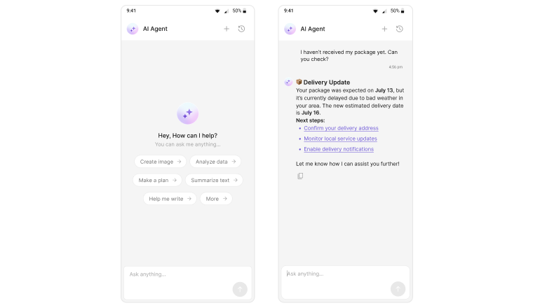

  

# iOS AI Agents Sample App by CometChat

This reference application demonstrates how to seamlessly integrate CometChat's [CometChat's iOS UI Kit](https://www.cometchat.com/docs/ui-kit/ios/overview) into a iOS project. It showcases the implementation of AI-powered chat agents using the UI Kit, highlighting how developers can leverage its prebuilt components to create rich, interactive messaging experiences with minimal effort.

   

## Pre-requisite

1. Login to the [CometChat Dashboard](https://app.cometchat.com/).
2. Select an existing app or create a new one and note the _`APP_ID`_, _`REGION`_ and _`AUTH_KEY`_.

## Run the Sample App

1. Clone this repository.
2. Open `CometChatUIKitSwift.xcodeproj` in Xcode.
3. Wait for Xcode to automatically resolve SPM packages.
4. Update the app credentials `APP_ID`, `REGION` and `AUTH_KEY` in the [AppConstants.swift](AppConstants.swift) file.
5. Select the **AISampleApp** scheme and run the sample app.

## Help and Support

For issues running the project or integrating with our UI Kits, consult our [documentation](https://www.cometchat.com/docs/ui-kit/ios/overview) or create a [support ticket](https://help.cometchat.com/hc/en-us) or seek real-time support via the [CometChat Dashboard](https://app.cometchat.com/).
