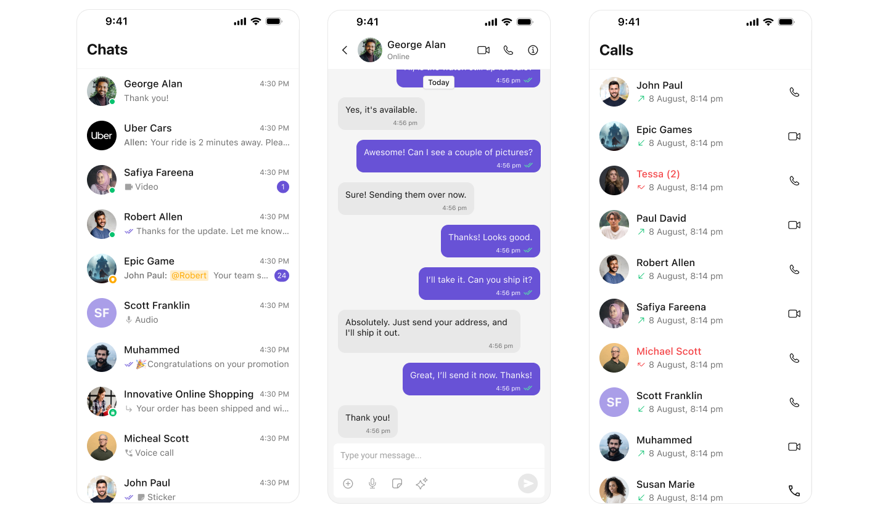

<p align="center">
  
</p>

# CometChat iOS UI Kit

CometChat Swift UIKit provides a pre-built user interface kit that developers can use to quickly integrate a reliable & fully-featured chat experience into an existing or a new mobile app.<br />

<div style="
    display: flex;
    align-items: center;
    justify-content: center;">
   
</div>

## 🚀 Explore the Sample Apps!

Dive straight into our Sample Apps to see CometChat UI Kit in action! Whether you're building a messaging app or enhancing your existing project, this sample app showcases the full potential of our iOS UI components.

- [Sample App ](SampleApp#readme)
- [Sample App for AI Agents](AISampleApp#readme)
- [Sample App with APNs Push Notifications](SampleAppPushNotificationAPNs#readme)


## Prerequisites

 - Xcode 15 or later
 - iOS 15.1 and later

## Installation

### Swift Package Manager

CometChat UI Kit is distributed as a Swift package.

**In Xcode:** File → Add Package Dependencies…, enter the package URL, and add the `CometChatUIKitSwift` product to your app target:

```
https://github.com/cometchat/cometchat-uikit-ios.git
```

**In a `Package.swift`:**

```swift
dependencies: [
    .package(url: "https://github.com/cometchat/cometchat-uikit-ios.git", from: "5.2.1")
],
targets: [
    .target(
        name: "YourApp",
        dependencies: [
            .product(name: "CometChatUIKitSwift", package: "cometchat-uikit-ios")
        ]
    )
]
```

For the full list of released versions, see the [releases page](https://github.com/cometchat/cometchat-uikit-ios/releases).

### CocoaPods (deprecated)

CocoaPods distribution is **deprecated** and is no longer maintained. Please use
Swift Package Manager (above). Existing CocoaPods integrations should migrate to SPM;
no new CocoaPods versions will be published.

## Getting Started

To set up Swift Chat UIKit and utilize CometChat for your chat functionality, you'll need to follow these steps:
1. Registration: Go to the [CometChat Dashboard](https://app.cometchat.com/) and sign up for an account.
2. After registering, log into your CometChat account and create a new app. Once created, CometChat will generate an Auth Key and App ID for you. Keep
   these credentials secure as you'll need them later.
3. Check the [Key Concepts](https://www.cometchat.com/docs/fundamentals/key-concepts) to understand the basic components of CometChat.
4. Refer to the [Integration Steps](https://www.cometchat.com/docs/ui-kit/ios/getting-started) in our documentation to integrate the UI Kit into your iOS app.

## Integrate with AI Coding Agents

[CometChat Agent Skills](https://www.cometchat.com/docs/agent-skills) teach your AI coding agent how to build with the CometChat iOS UI Kit in Swift apps. Ask your agent to *"add chat to my app"* and it detects your project setup, walks you through a short plan for your approval, and then writes the integration code directly into your existing app, following the official CometChat guides. The skills work with Claude Code, Cursor, GitHub Copilot, Codex, Windsurf, and other popular coding agents.

Run the installer in your project root (requires Node.js 18+):

```bash
npx @cometchat/skills add
```

The skills are installed for Claude Code by default; pass `--ide <agent>` (for example, `--ide cursor`) to install them for a different agent. Then open your project in your agent and prompt it with *"add chat to my app"*, or run `/cometchat`.

To learn more, visit [CometChat Agent Skills](https://www.cometchat.com/docs/agent-skills).

## Help and Support
For issues running the project or integrating with our UI Kits, consult our [documentation](https://www.cometchat.com/docs/ui-kit/ios/overview) or create a [support ticket](https://help.cometchat.com/hc/en-us) or seek real-time support via the [CometChat Dashboard](https://app.cometchat.com/).
